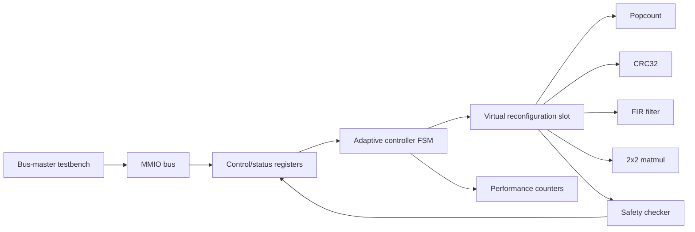

# EvoFabric

EvoFabric is a simulation-first SystemVerilog project that models a safe self-adaptive FPGA-style compute fabric. The design uses a RISC-V-style control path, memory-mapped accelerator registers, an adaptive controller, performance counters, a safety checker, and a mux-selected virtual partial-reconfiguration accelerator slot.

This is not a vendor partial-reconfiguration implementation and does not target a physical FPGA board yet. The goal is to demonstrate computer architecture, RTL design, accelerator integration, and verification concepts in a clean, portable simulation environment.

## Why It Matters

Modern FPGA SoCs often combine a processor, memory-mapped peripherals, hardware accelerators, runtime monitoring, and safety logic. EvoFabric explores those ideas at a beginner-readable scale:

- A software-style control path starts accelerator requests through MMIO registers.
- A controller selects accelerators based on opcode, availability, and error history.
- A virtual reconfiguration slot simulates runtime accelerator swapping with a mux.
- A safety checker recomputes trusted reference results and forces fallback on mismatch.
- Testbenches generate VCD waveforms that make the runtime behavior inspectable in GTKWave.

The result is a compact architecture project that is honest about its limits while still showing real RTL structure, verification discipline, and system-level thinking.

## Architecture Summary

At the top level, `evofabric_top.sv` exposes a small memory-mapped bus. A bus-master testbench writes operands and an opcode into control/status registers, then sets a start bit. The adaptive controller selects an accelerator, launches the virtual reconfiguration slot, waits for completion, and records status through performance counters. When the selected accelerator finishes, the safety checker compares the output against reference logic and returns either the accelerator result or a trusted fallback result.



## Module List

| Area | Module | Purpose |
| --- | --- | --- |
| Top level | `rtl/soc/evofabric_top.sv` | Connects MMIO bus, registers, controller, slot, checker, and counters |
| Control | `rtl/control/adaptive_controller.sv` | FSM that chooses an accelerator, starts work, handles errors, and enables fallback |
| Control | `rtl/control/accel_safety_checker.sv` | Reference-result checker for supported opcodes |
| SoC | `rtl/soc/virtual_reconfig_slot.sv` | Mux-selected accelerator slot that simulates runtime reconfiguration |
| Monitors | `rtl/monitors/performance_counters.sv` | Tracks cycles, calls, failures, selected accelerator, and latency |
| Interconnect | `rtl/interconnect/mmio_bus.sv` | Decodes accelerator and performance counter register windows |
| Core placeholder | `rtl/core/rv32i_placeholder.sv` | Minimal RV32I-style placeholder, not a full CPU |
| Memories | `rtl/soc/instruction_memory.sv`, `rtl/soc/data_memory.sv` | Simple instruction/data memory placeholders |
| Accelerators | `rtl/accelerators/popcount_accel.sv` | 32-bit population count |
| Accelerators | `rtl/accelerators/crc32_accel.sv` | CRC32 over one 32-bit word |
| Accelerators | `rtl/accelerators/fir_filter_accel.sv` | Small fixed-point FIR-style operation |
| Accelerators | `rtl/accelerators/matmul2x2_accel.sv` | 2x2 signed integer matrix multiply |
| Definitions | `rtl/accelerators/evofabric_defs.svh` | Shared opcode and accelerator ID constants |

## Project Tree

```text
EvoFabric/
├── Makefile
├── README.md
├── docs/
│   ├── architecture.md
│   ├── recruiter_summary.md
│   └── waveform_verification.md
├── rtl/
│   ├── accelerators/
│   │   ├── crc32_accel.sv
│   │   ├── evofabric_defs.svh
│   │   ├── fir_filter_accel.sv
│   │   ├── matmul2x2_accel.sv
│   │   └── popcount_accel.sv
│   ├── control/
│   │   ├── accel_safety_checker.sv
│   │   └── adaptive_controller.sv
│   ├── core/
│   │   └── rv32i_placeholder.sv
│   ├── interconnect/
│   │   └── mmio_bus.sv
│   ├── monitors/
│   │   └── performance_counters.sv
│   └── soc/
│       ├── data_memory.sv
│       ├── evofabric_top.sv
│       ├── instruction_memory.sv
│       └── virtual_reconfig_slot.sv
├── scripts/
│   └── run_all.sh
└── tb/
    ├── tb_accelerator_interface.sv
    ├── tb_adaptive_controller.sv
    ├── tb_bad_result_fallback.sv
    ├── tb_crc32_accel.sv
    ├── tb_fir_filter_accel.sv
    ├── tb_matmul2x2_accel.sv
    ├── tb_popcount_accel.sv
    ├── tb_safety_checker.sv
    └── tb_top_workload_switching.sv
```

Generated directories:

- `sim/` stores compiled simulation binaries.
- `waves/` stores generated VCD waveform files.

## Build and Simulation

EvoFabric uses Icarus Verilog for simulation and GTKWave for waveform inspection.

```sh
make test
```

This compiles all RTL/testbenches and runs:

- `tb_popcount_accel`
- `tb_crc32_accel`
- `tb_fir_filter_accel`
- `tb_matmul2x2_accel`
- `tb_accelerator_interface`
- `tb_adaptive_controller`
- `tb_safety_checker`
- `tb_top_workload_switching`
- `tb_bad_result_fallback`

Each testbench resets the design, applies clear vectors, checks expected outputs or state transitions, prints `PASS` or `FAIL`, and writes a VCD file under `waves/`.

## Makefile Commands

| Command | Description |
| --- | --- |
| `make test` | Compile and run all SystemVerilog testbenches |
| `make test-accels` | Run accelerator and common-interface tests |
| `make test-top` | Run controller, checker, top-level, and fallback tests |
| `make wave` | Run tests, list generated VCD files, and show a GTKWave command hint |
| `make waves` | Backward-compatible alias for `make wave` |
| `make clean` | Remove generated simulation output in `sim/` and `waves/` |

## Opening Waveforms

After running `make test`, open a waveform manually:

```sh
gtkwave waves/tb_top_workload_switching.vcd
```

Useful waveforms:

- `waves/tb_top_workload_switching.vcd` for MMIO-driven workload switching.
- `waves/tb_bad_result_fallback.vcd` for injected bad output, safety mismatch, and fallback behavior.
- `waves/tb_adaptive_controller.vcd` for controller state transitions and accelerator quarantine.

See [docs/waveform_verification.md](docs/waveform_verification.md) for a signal-by-signal guide.

## Expected Waveform Behavior

The expected high-level behavior is:

- Reset drives control outputs, counters, and result registers to known values.
- A valid request writes operands/opcode, then pulses the start bit.
- The controller asserts `accel_start` for the selected accelerator.
- The chosen accelerator asserts `busy`, then later asserts `done`.
- `selected_accel` reflects the opcode-specific accelerator ID.
- The virtual slot mux exposes the selected accelerator output.
- The safety checker keeps `mismatch` low for correct outputs.
- In the injected-fault test, `mismatch` asserts and the checked output returns the trusted reference result.
- Performance counters update call count, failure count, selected accelerator, and latency.

## Verification Evidence

The testbenches verify the following behaviors:

- [x] Popcount accelerator returns the expected bit count.
- [x] CRC32 accelerator matches the testbench reference function.
- [x] FIR accelerator completes its multi-cycle fixed-point operation.
- [x] 2x2 matrix multiply accelerator returns four output words.
- [x] Common accelerator interface asserts `busy`, `done`, `error`, `cycle_counter`, and `accelerator_id` as expected.
- [x] Adaptive controller selects the opcode-matching accelerator.
- [x] Controller disables an accelerator after a checker mismatch.
- [x] Safety checker detects a bad result and supplies the fallback reference output.
- [x] Top-level workload switching runs multiple accelerator requests through MMIO-style writes.
- [x] Deliberate fault injection triggers fallback and future requests use the fallback path.
- [x] VCD files are generated for waveform inspection in GTKWave.

## Register Map

The top-level memory-mapped interface uses word addresses:

| Address | Name | Description |
| --- | --- | --- |
| `0x00` | CONTROL | bit 0 starts a request, bits `[7:4]` hold opcode, bit 8 clears counters |
| `0x04` | INPUT_A | Operand A |
| `0x08` | INPUT_B | Operand B |
| `0x0C` | INPUT_C | Operand C |
| `0x10` | INPUT_D | Operand D |
| `0x14` | OUTPUT_0 | Result word 0 |
| `0x18` | OUTPUT_1 | Result word 1 |
| `0x1C` | OUTPUT_2 | Result word 2 |
| `0x20` | OUTPUT_3 | Result word 3 |
| `0x24` | STATUS | Busy, fallback, checker error, selected accelerator, disabled accelerators |
| `0x100` | TOTAL_CYCLES | Free-running cycle counter |
| `0x104` | CALLS | Number of requests |
| `0x108` | FAILURES | Safety or accelerator failures |
| `0x10C` | LAST_SELECTED | Last selected accelerator ID |
| `0x110` | LAST_LATENCY | Last operation latency |
| `0x114` | BEST_LATENCY | Best observed latency |

## Opcodes

| Opcode | Operation |
| --- | --- |
| `1` | Popcount |
| `2` | CRC32 over one 32-bit word |
| `3` | Four-tap FIR-style operation: `a + 2b + 3c + 4d` |
| `4` | 2x2 signed integer matrix multiply |

## Accelerator IDs

| ID | Accelerator |
| --- | --- |
| `0` | None |
| `1` | Popcount |
| `2` | CRC32 |
| `3` | FIR |
| `4` | 2x2 matrix multiply |
| `15` | Safe fallback |

## STATUS Bits

| Bits | Description |
| --- | --- |
| `[23:20]` | Disabled accelerator bits, indexed by accelerator ID `4:1` |
| `[19:16]` | Selected accelerator ID |
| `[15]` | Slot busy |
| `[14]` | Fallback currently used |
| `[13]` | Checker mismatch/fallback forced |
| `[12]` | Done interrupt pulse |
| `[1]` | Operation active |
| `[0]` | Accelerator error |

The deliberate fault-injection simulation is safety-only verification. The testbench flips one selected accelerator result through `fault_inject`, verifies the checker mismatch pulse, verifies fallback is used, confirms the accelerator is quarantined, and checks that `FAILURES` increments once.

## Documentation

- [Architecture](docs/architecture.md)
- [Waveform verification guide](docs/waveform_verification.md)
- [Recruiter summary](docs/recruiter_summary.md)

## Safety Scope

EvoFabric is for learning FPGA design, computer architecture, simulation, and safe adaptive hardware. It does not include malware, covert channels, RowHammer logic, destructive hardware behavior, voltage abuse, side-channel leakage, cryptographic evasion, or offensive security features.

## Current Limitations

- The RV32I block is a placeholder, not a full instruction-executing CPU.
- Runtime reconfiguration is modeled with a mux, not vendor partial reconfiguration.
- The design is simulation-first and has not been synthesized for a board.
- The testbenches are directed tests, not constrained-random verification.
- The memory system is intentionally simple and does not model cache coherence or DMA.

## Future Work

- Replace the placeholder core with a small RV32I CPU or richer bus functional model.
- Add formal verification for handshakes, one-hot selection, and fallback invariants.
- Add constrained-random stimulus and scoreboards.
- Add a simple interrupt controller and DMA-style input/output path.
- Track per-accelerator latency histories instead of only global last/best latency.
- Add synthesis constraints for a specific educational FPGA board.
- Prototype real Xilinx or Intel partial reconfiguration while keeping safety checker and fallback logic in static trusted RTL.
