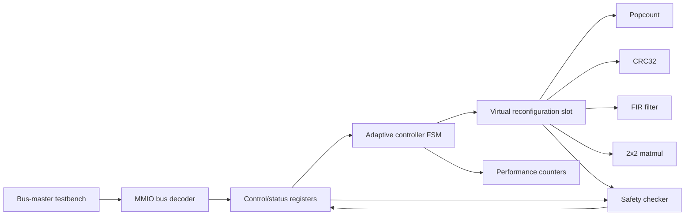

# EvoFabric Architecture

EvoFabric is a simulation-first SystemVerilog SoC model for studying safe adaptive FPGA compute fabrics. It is intentionally small enough to read, but it includes the architectural pieces that make the system interesting: a RISC-V-style control path, memory-mapped accelerator registers, runtime accelerator selection, performance monitoring, and correctness checking with fallback.

The project does not implement real Xilinx or Intel partial reconfiguration. Instead, it models the same architectural boundary with a mux-selected accelerator slot so the behavior can be tested with ordinary open-source simulation tools.

## System Overview

The top-level flow is:

1. A testbench writes operands to MMIO registers.
2. The testbench writes an opcode and start bit to the control register.
3. The adaptive controller chooses an accelerator based on opcode, availability, and prior failures.
4. The virtual reconfiguration slot starts only the selected accelerator.
5. The selected accelerator computes a result and asserts `done`.
6. The safety checker recomputes the expected result and compares outputs.
7. The top-level registers expose the checked result, status bits, and performance counters.

## RISC-V-Style Control Path

The project includes `rtl/core/rv32i_placeholder.sv` to mark where a real RV32I control processor would eventually fit. This placeholder is not a complete CPU. It provides a simple architectural placeholder for a program-counter-like signal and bus-control-style outputs.

Current simulations use bus-master testbenches instead of executing RISC-V instructions. This keeps the project focused on accelerator integration, MMIO behavior, controller logic, safety checking, and waveform verification.

Future versions could replace the placeholder with:

- a small RV32I core,
- a richer bus functional model,
- or a software-driven firmware loop that writes the same MMIO register map.

## MMIO Accelerator Interface

`rtl/interconnect/mmio_bus.sv` decodes a small register space into accelerator and performance counter windows.

The accelerator register window starts at `0x00`:

- `CONTROL` holds the start bit, opcode, and counter-clear bit.
- `INPUT_A` through `INPUT_D` hold 32-bit operands.
- `OUTPUT_0` through `OUTPUT_3` expose checked results.
- `STATUS` exposes busy/error/fallback information and disabled accelerator state.

The performance counter window starts at `0x100`:

- total cycles,
- calls,
- failures,
- last selected accelerator,
- last operation latency,
- best observed latency.

This is a deliberately simple MMIO model. It is enough to show how software-visible registers can control a hardware accelerator fabric without adding bus protocol complexity that would distract from the adaptive logic.

## Common Accelerator Interface

Every accelerator follows the same interface pattern:

- `clk`, `rst_n`
- `start`, `done`, `busy`, `valid`
- `opcode`
- `input_a`, `input_b`, `input_c`, `input_d`
- `output_0`, `output_1`, `output_2`, `output_3`
- `error`
- `cycle_counter`
- `accelerator_id`

This common interface makes the virtual slot simple: the controller selects an accelerator ID, the slot gates `start` to that module, and a mux forwards the selected module's status and outputs.

## Virtual Partial-Reconfiguration Slot

`rtl/soc/virtual_reconfig_slot.sv` models a reconfigurable accelerator partition by instantiating all accelerators and mux-selecting one output path.

This is honest simulation, not real partial reconfiguration. No bitstreams are loaded and no vendor PR controller is used. The design models the architectural concept:

- fixed static logic controls the slot,
- accelerators share a stable interface,
- only one selected accelerator is visible at a time,
- safety checking remains outside the reconfigurable boundary.

To turn this into real vendor partial reconfiguration later, the slot boundary could become a reconfigurable partition while the controller, MMIO registers, safety checker, and fallback reference logic remain static trusted logic.

## Adaptive Controller FSM

`rtl/control/adaptive_controller.sv` is the main policy block. It receives:

- a request-valid pulse,
- an opcode,
- accelerator availability bits,
- accelerator completion/error feedback,
- checker mismatch feedback.

The controller chooses the opcode-matching accelerator when it is available and not disabled. If the accelerator reports an error or the safety checker reports a mismatch, the controller marks that accelerator disabled. Later requests for the same operation can be routed through fallback instead of reusing the failed accelerator.

The FSM states are intentionally small:

- idle,
- start,
- wait,
- fallback.

This keeps the policy readable and easy to inspect in a waveform.

## Performance Counters

`rtl/monitors/performance_counters.sv` tracks basic runtime evidence:

- total cycles,
- number of accelerator requests,
- number of failures,
- last selected accelerator,
- last operation latency,
- best observed latency.

These counters are not a full profiling subsystem, but they demonstrate how an adaptive fabric can expose runtime information to software or a controller.

## Safety Checker and Fallback Path

`rtl/control/accel_safety_checker.sv` recomputes expected results using trusted reference logic for each supported opcode. It compares the selected accelerator output against that reference.

If the selected accelerator output is correct:

- `mismatch` stays low,
- checked outputs match accelerator outputs.

If the selected accelerator output is incorrect:

- `mismatch` asserts,
- `fallback_forced` asserts,
- checked outputs are replaced with reference outputs,
- the adaptive controller can disable the failing accelerator.

`tb_bad_result_fallback.sv` demonstrates this path by enabling `fault_inject`, which flips one output bit from the virtual slot. The checker catches the mismatch and the top-level output still returns the trusted reference value.

## Accelerator Modules

EvoFabric includes four safe accelerators:

| Accelerator | Opcode | Behavior |
| --- | --- | --- |
| `popcount_accel.sv` | `1` | Counts set bits in `input_a` |
| `crc32_accel.sv` | `2` | Computes CRC32 over one 32-bit word |
| `fir_filter_accel.sv` | `3` | Computes a small four-input FIR-style expression |
| `matmul2x2_accel.sv` | `4` | Multiplies two packed 2x2 signed integer matrices |

The accelerators are intentionally compact. Their purpose is to exercise the interface, mux selection, checker, controller, latency counters, and waveform inspection.

## Verification Strategy

The verification approach is directed simulation:

- individual accelerator testbenches check each compute block,
- an interface test checks common handshake behavior,
- controller tests check selection and disable/fallback policy,
- safety checker tests check mismatch detection,
- top-level tests drive MMIO-style workloads,
- fault-injection tests check fallback recovery.

See [waveform_verification.md](waveform_verification.md) for detailed GTKWave inspection guidance.

## Current Boundaries

The project is intentionally honest about what it does not yet do:

- no full RV32I instruction execution,
- no physical FPGA synthesis flow,
- no real vendor partial-reconfiguration bitstream loading,
- no constrained-random verification,
- no production bus protocol such as AXI.

Those boundaries keep the repository focused on clear RTL architecture and simulation evidence.
