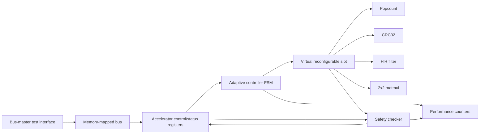

# EvoFabric Architecture

EvoFabric is organized as a small simulation-first adaptive SoC. A simple bus-master test interface writes operands and an opcode into memory-mapped control registers. The adaptive controller chooses an accelerator, starts the virtual reconfiguration slot, and waits for completion. The safety checker recomputes the expected result in reference logic and returns either the accelerator output or a safe fallback value.

## Block Diagram



## Common Accelerator Interface

Every accelerator uses the same port shape:

- `clk`, `rst_n`
- `start`, `done`, `busy`, `valid`
- `opcode`
- `input_a`, `input_b`, `input_c`, `input_d`
- `output_0`, `output_1`, `output_2`, `output_3`
- `error`
- `cycle_counter`
- `accelerator_id`

This keeps the slot mux simple and makes it easy to add more safe accelerators later.

## Virtual Reconfiguration

The `virtual_reconfig_slot` instantiates all accelerators and gates `start` to exactly one selected module. Its output mux acts like a simulation model of a reconfigurable partition.

In a future Xilinx or Intel FPGA flow, this boundary could become a real partial reconfiguration region:

- Keep the common accelerator interface stable.
- Move each accelerator implementation into a reconfigurable module variant.
- Replace the mux selection with vendor PR controller software and bitstream loading.
- Keep the safety checker outside the reconfigurable region so it remains trusted static logic.
- Keep fallback/reference logic outside the reconfigurable region.

This repository intentionally avoids vendor-specific PR IP for now so the design stays portable and easy to simulate.

## Safety Checker and Fallback

`accel_safety_checker` recomputes the expected result for each supported opcode. If any output word differs from the selected accelerator output, it raises `mismatch` and returns the reference result instead. The adaptive controller then disables that accelerator id for future requests and routes matching work through fallback.

The test `tb_bad_result_fallback` intentionally flips one output bit with `fault_inject`. The checker repairs the result, and the controller quarantines the selected accelerator.

## Performance Counters

`performance_counters` tracks:

- total cycles
- call count
- failure count
- last selected accelerator
- last latency
- best latency

These counters are readable through the `0x100` performance register window.

## Simulation

Run all tests:

```sh
make test
```

Run one test manually:

```sh
make build/tb_top_workload_switching
vvp build/tb_top_workload_switching
```

Inspect waveforms:

```sh
gtkwave build/tb_bad_result_fallback.vcd
```

Useful signals to inspect include `selected_accel`, `disabled_accels`, `mismatch`, `fallback_forced`, `slot_done`, `irq_done`, and `result_0`.

## Future Work

- Replace the placeholder CPU with a small RV32I core or a richer bus functional model.
- Add a real interrupt controller and DMA-like data path.
- Add constrained-random tests and scoreboards.
- Add formal checks for handshake safety and one-hot accelerator selection.
- Add synthesis constraints for a specific educational FPGA board.
- Prototype real partial reconfiguration while keeping the checker and fallback path in static trusted logic.
